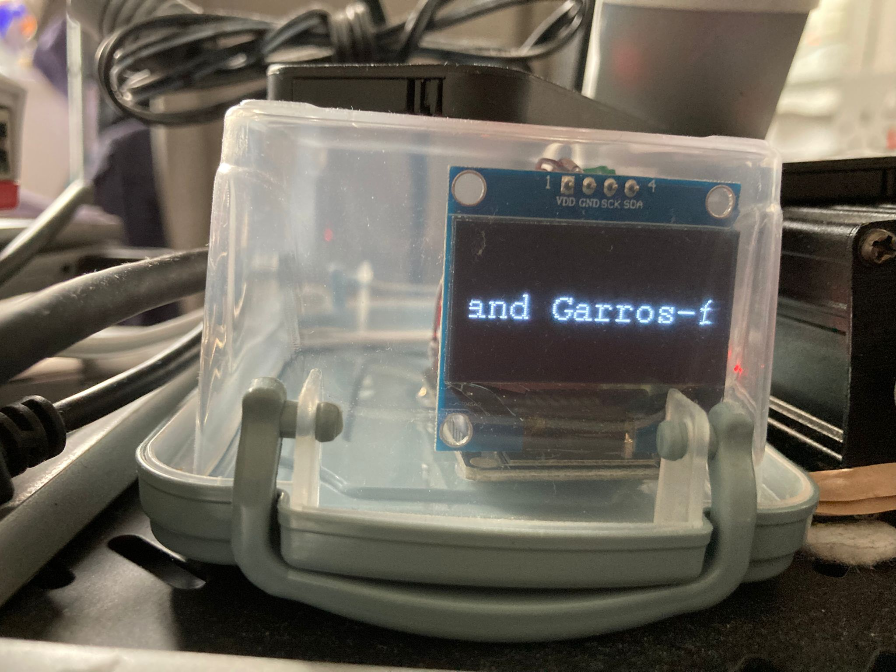
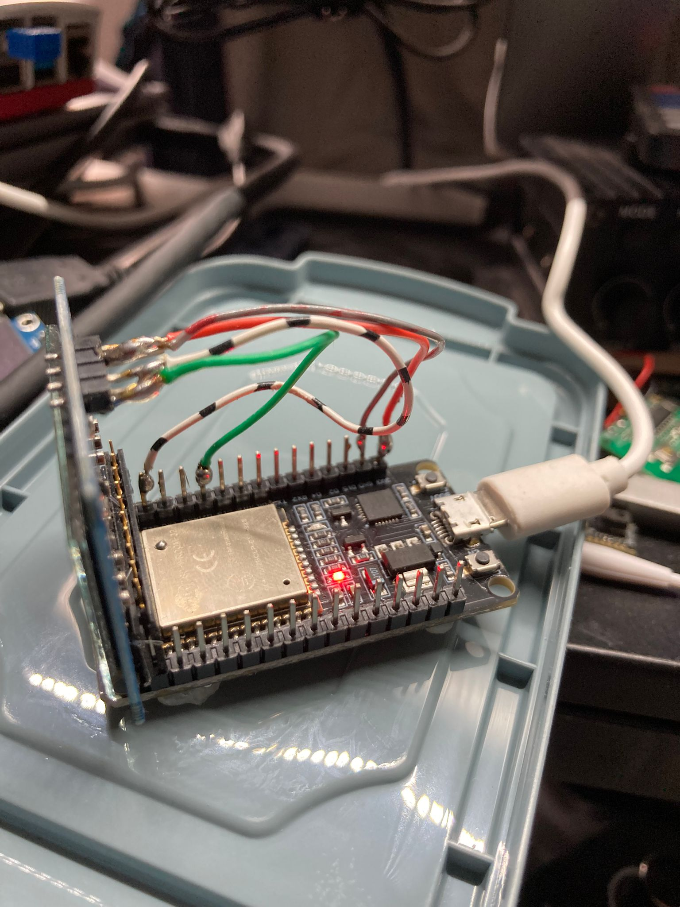

# ESP-32-RSS-News-Feed-Ticker
Showing customised RSS Feeds on a OLED display, never miss the latest head lines

# ESP-32 RSS News Ticker

I had some ESP-32 DEVKITs left over and a SH1106 OLED display. I thought wouldn't be nice to have a news ticker that would be playing away in the back ground.

I am Dutch living in the UK so my feeds are a mixture of Dutch /UK and international news but as long as you can find the RSS feed, you can display anything you like.

**Prerequisites:**
 1. ESP-32 Devkit or similar
 2. Wifi internet connection :-)
 3. SH1106 OLED screen. (Will work with different different I2C  OLEDs but the code needs to be modified
 4. Arduino IDE
 5. Hookup wiring or soldering skills

**Libraries** 

 1. WiFi
 2. WiFiClientSecure (which I think is part of WiFi library)
 3. HTTPClient
 4. ArduinoJson
 5. U8g2lib

==Feel free to have a play==

